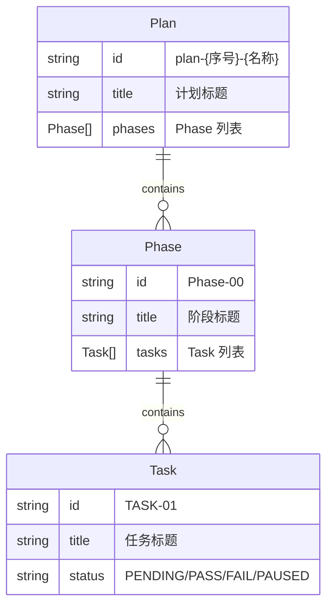

# 第三章（补充）：常衡的计划管理系统

> updated_by: SoloEnt - Claude-Sonnet-3.5
> updated_at: 

<!-- // 给 AGENTS 的引导 -->
<!-- 用户口述内容，即时记录 -->
<!-- // -->

## Plan 的创建

之前我们已经讲过和 Gitea 的映射关系。创建一个 Plan 的时候，应该调用 CLI 执行命令：

```bash
POST /apps/:app/plans "plan-102-A-Title"
```

实际对应的是调用 Gitea 的 `createRepo` 接口。

创建完成后，会把一些基础信息写入 Repo，比如：
- **Requirements（需求）**：要做什么
- **Specs（规格）**：做成什么样
- **Design（设计）**：怎么做

> **注**：具体用哪个接口写入文件，暂未确定，先记录不实现。

## Phase 的创建

接下来是创建 **Phase**，对应 Gitea 的 `createMilestone` 接口。

**接口定义**：
```bash
POST /apps/:app/plans/:plan/phases "Phase-00"
```

**操作顺序**：
- 不是一次性把所有 Phase 都创建出来
- 而是每创建一个 Phase，然后创建这个 Phase 下面的 Task
- 想象成一种**点对点的操作**

**操作模型**：
- 用户可以**点对点操作 Phase**
- 用户可以**点对点操作 Task**（Task 在 Phase 层级之下）
- 创建顺序：Phase-00 → Phase-00 下的 Tasks → Phase-01 → Phase-01 下的 Tasks → ...

## Task 的创建

Task 的创建，使用**编号**和 **Title** 作为参数。

**接口定义**：
```bash
POST /apps/:app/plans/:plan/tasks "Task-01: 实现数据获取模块"
```

对应 Gitea 的 `createIssue` 接口。

> **注**：Phase 和 Task 理论上还有其他字段（如 Description、Body 等），暂不展开讨论。

## 编号的自增逻辑

**Phase 编号**：
- 需要查询当前已存在的 Phase 编号
- 自动自增（+1）
- 例如：Phase-00 → Phase-01 → Phase-02...

**Task 编号**：
- Task 独立编号，不再保留 Phase 的前缀
- 使用两位数编码（01-99）
- 在同一 Phase 下按顺序递增
- 例如：Task-01 → Task-02 → Task-03...
- Phase 信息通过 Task 所属的 Milestone（Phase）关联，不体现在编号中

**封装层级**：
- **api.go**：保持干净，只负责接口调用
- **plan.go**：封装编号自增的业务逻辑
- **Domain 层**（可选）：更高层的领域抽象

> **注**：编号自增逻辑应该在 plan.go 或 Domain 层实现，不应该放在 api.go

## Domain 设计（示意图）

> **注**：以下为**示意图**，不是真实的架构设计，只是用于理解概念。

根据 Gitea 的映射关系，设计 Domain 层：

### 实体关系



### 层级结构

| Domain 实体 | Gitea 映射 |
|-------------|------------|
| Plan | Repo |
| Phase | Milestone |
| Task | Issue |

### 核心操作（示意图）

> **注**：以下操作签名为**示意图**，不是真实实现。

**Plan 操作**：
- `CreatePlan(title string) → Plan`
- `GetPlan(id string) → Plan`

**Phase 操作**：
- `CreatePhase(planId, title string) → Phase`
- `GetNextPhaseNumber(planId) → string`（自增逻辑，返回如 "01"）

**Task 操作**：
- `CreateTask(phaseId, title string) → Task`
- `GetNextTaskNumber(phaseId) → string`（自增逻辑，返回如 "01"）

## 在现有 Task 之间插入新 Task

**场景**：在 Phase-00 下的 Task-01 和 Task-02 之间插入一个新 Task

**问题**：编号如何处理？

### 插入编号原则（完整算法）

**输入**：用户指令"在 LL 和 RR 之间插入 NN"

**目标**：生成一个位于 `L` 和 `R` 之间的新编号 `N`

**算法步骤**：

1. **检查 LL 和 RR 之间有没有空位**
   - 遍历 LL+1 到 RR-1，检查是否有未被占用的编号
   - **如果没有空位**（即 LL+1 ~ RR-1 全满）→ 需要新增位数（追加两层）
   - **如果有空位** → 进入下一步

2. **如果有空位，则该区间一定是全空的**
   - 因为我们就是在空档插入
   - 如果该区间不是全空的 → **插入指令有问题**（应该先清理旧数据）
   - 此时直接使用"靠左 1/3，向上取整"算法

3. **靠左 1/3，向上取整**
   - 区间扩展为该层的完整范围（00-99）
   - Offset = ceil(99 × 1/3) = 33
   - N = L前缀 + 33

**示例**：

| 场景 | L | R | 结果 |
|------|------|------|------|
| 有空位（全空） | Task-01 | Task-02 | N = Task-01-33 |
| 无空位（00-99全满） | Task-01-99 | Task-01-99 | 追加两位：N = Task-01-99-33 |
| 有空位但非全空 | Task-01-01 | Task-01-03 | **错误**：插入指令有问题 |

**核心原则**：
1. 先检查空位：没有空位 → 追加新层级
2. 有空位则必是全空（因为就是在空档插入），可直接用"靠左1/3向上取整"
3. 如果有空位但非全空 → 插入指令错误
4. **每层编号严格限制为 00-99**，层数可以无限扩展


