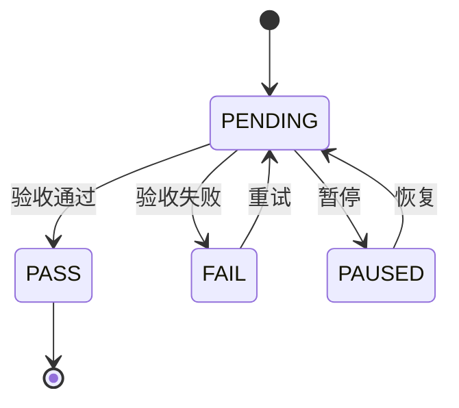

# 第三章：常衡的计划管理系统

> updated_by: SoloEnt - Claude-Sonnet-3.5
> updated_at: 2026-03-17 23:12:00

<!-- // 给 AGENTS 的引导 -->
<!-- 第三章聚焦常衡搭建计划管理系统的过程 -->
<!-- 用户提供内容，我负责记录优化 -->
<!-- // -->

## 计划管理系统的规格说明（Specs）

常衡坐在书桌前，面前摊开着几张写得密密麻麻的A4纸。窗外是城市的夜景，霓虹灯光在玻璃上投下斑驳的影子。

他已经在脑海中构建了量化系统的整体框架，但要把这个框架变成可执行的系统，还需要一样东西：计划。

作为一个物理老师，他习惯用严谨的思维来对待任何系统。于是他决定先写一份规格说明书（Specs），把计划管理系统的规则明确定义下来。

---

### 1. 计划的基本组成

**计划包含以下几个部分：**

- **Requirements（需求）**：要做什么
- **Specs（规格）**：做成什么样
- **Design（设计）**：怎么做
- **Tasks Breakdown（任务拆解）**：具体执行步骤

本次着重定义的是 **Tasks Breakdown（任务拆解）** 的规格。

---

### 2. 任务拆解的层级结构

**任务拆解采用两层结构：**

| 层级 | 说明 |
|------|------|
| **Phase（阶段）** | 从 00 到 99，写作 Phase-00 |
| **Task（任务）** | 隶属于 Phase |

**约束**：总共就两层，Phase - Task，不能有多余的层级。

---

### 3. 排序规则

- **Phase 严格排序**：从上到下，依次执行 Phase-00、Phase-01、Phase-02...
- **Task 严格排序**：在同一 Phase 内，从上到下依次执行
- **禁止跳过**：不能跳过任何一个 Phase 或 Task
- **暂停标记**：如有特殊要求，可标记为"暂停"（PAUSED）

---

### 4. 任务编号规则

- **编号格式**：Task-XXXX（4位数字）
- **编码规则**：使用所属 Phase 的编码作为前缀

| Phase | 包含的 Task |
|-------|-------------|
| Phase-01 | Task-0101、Task-0102、Task-0103... |
| Phase-02 | Task-0201、Task-0202、Task-0203... |

这样可以快速识别一个 Task 属于哪个 Phase。

---

### 5. Task 的结构定义与类型

**每个 Task 都遵循统一的数据结构：**

```markdown
- [ ] **TASK-xxx**: {Task Title}
  - **Dependencies**:
    - TASK-xxx
  - **Background**:
    - {背景信息/上下文/前置知识}
  - **Do**: 
    - [ ] {要执行的动作 -> 预期产出物}
    - [ ] {要推进的事项}
  - **Check**: 
    - [ ] {验收/验证标准}
    - [ ] {观测信号/指标}
  - **Act**: {根据验收结果自动设置}
```

**TypeScript 类型定义：**

```typescript
// 任务状态枚举
enum TaskStatus {
  PENDING = 'PENDING',   // 待执行（只有此状态可被执行）
  PASS = 'PASS',         // 验收通过
  FAIL = 'FAIL',         // 验收失败
  PAUSED = 'PAUSED'     // 暂停
}

// 任务实体
interface Task {
  id: string;              // TASK-xxx 格式
  title: string;           // 任务标题
  dependencies: string[];  // 依赖的 Task ID 列表
  background: string[];    // 背景信息列表
  do: string[];            // 执行动作列表（带勾选框）
  check: string[];         // 验收条件列表（带勾选框）
  act: TaskStatus;         // 当前状态
}
```

**状态转移规则（Mermaid 图）：**



**说明**：

- **Conditions 不属于 Task 内部属性**，而是由外部的状态机规则引擎控制
- 这就是 DDD 的富血模型——将业务逻辑从实体中分离到领域服务中
- **禁止添加字段**，除了 **Background** 和 **Dependencies** 这两个必要字段外，其他信息都必须包含在 Do 和 Check 中

---

### 6. Phase 的数据结构

**Phase 的结构相对简单：**

```typescript
// Phase 实体
interface Phase {
  id: string;       // Phase-00 格式
  title: string;    // 阶段标题
  tasks: Task[];    // 任务数组
}
```

- **Phase 本身没有 DCA（Data Check Act）**，状态由外部控制
- **完成规则**：当所有 Task 都处于 PASS 状态时，Phase 自动标记为完成

---

### 7. Gitea 映射方案

"计划管理系统需要依托现有的 Gitea 来实现，"常衡写道：

**Repo 表示 Plan**：

- 使用 Gitea 的 **Repo** 来表示一个 **Plan（计划）**
- Repo 命名格式：`plan-{序号}-{名称}`
  - 例如：`plan-001-steering` 表示第001号计划，主题为 steering

**文件路径规则**：

- 计划文件保存在应用帐号的 `.plans` 目录下
- 完整路径：`app-a/.plans/{序号}-{主题}.md`
  - 例如：`app-a/.plans/001-steering.md` 表示 app-a 应用下的第001号计划

**Milestone 映射 Phase**：

- 使用 Gitea 的 **Milestone** 来表示 **Phase**
- 在 Repo 中创建 Milestone：`Phase-00`、`Phase-01`...
- Milestone 标题即为 Phase 的标识

**Issue 映射 Task**：

- 使用 Gitea 的 **Issue** 来表示 **Task**
- Issue 标题格式：`TASK-0101: {任务标题}`
- 在 Issue 中选中对应的 **Milestone**，即表示该 Task 属于该 Phase

**状态管理**：

| Task 状态 | Gitea 映射 |
|-----------|------------|
| PENDING | Issue 打开（Open） |
| PASS | Issue 关闭（Closed） + 标记完成 |
| FAIL | Issue 打开 + 标签标记失败 |
| PAUSED | Issue 打开 + 标签标记暂停 |

**示例**：

| 概念 | Gitea 映射 |
|------|------------|
| Plan | Repo：`plan-001-steering` |
| Phase | Milestone：`Phase-00` |
| Task | Issue：`TASK-0101: 实现数据获取模块` |
| 关联 | Issue 选中 Milestone `Phase-00` |

---

*（第三章完）*
